# Environment Analytics

A read-only Power Apps code app that shows the health of one Power Platform
environment: cloud flows and their runs, failures, canvas and model-driven apps,
solutions and their import history, Copilot Studio agents, connection
references, environment variables, system jobs and users.

It reads only the system tables every Dataverse environment already has. There
is no solution to import first, no custom table, no connector and no tenant
configuration in the code, so the same source deploys to any environment.

## Install

Download the latest solution from
[Releases](https://github.com/JakeBoraston/PowerPlatformEnvironmentAnalytics/releases)
and import it. Nothing to build.

1. **Turn on code apps for the environment**, if it isn't on already: Power
   Platform admin center > Environments > your environment > Settings >
   Product > Features > *Power Apps code apps* > **Enable code apps**. The app
   will not run without this.
2. **Import the solution.** In [make.powerapps.com](https://make.powerapps.com),
   pick the environment, then **Solutions > Import solution > Browse**, choose
   the zip, then **Next > Import**. Take the **managed** zip to use the app as
   it is; take the unmanaged one only if you intend to change it in that
   environment.
3. **Open it.** The solution contains one app, *Environment Analytics*. Open it
   from **Apps**, or from inside the solution.
4. **Share it with whoever needs it.** In **Apps**, select the app, then
   **Share**. They also need a Power Apps Premium licence and a security role
   that can read the tables (see below); without one, sections of the app report
   that they could not load rather than showing figures.

To update later, download the newer zip and import it the same way; it upgrades
the app in place. Building from source is covered further down, and is only
needed if you want to change the app.

## What's in it

Every page works in light and dark mode, and with a keyboard or screen reader.
Every chart has a written summary and a data table behind **Show data table**.
Colour is used for status only: green for succeeded, amber for needs attention,
red for failed.

### Dashboard

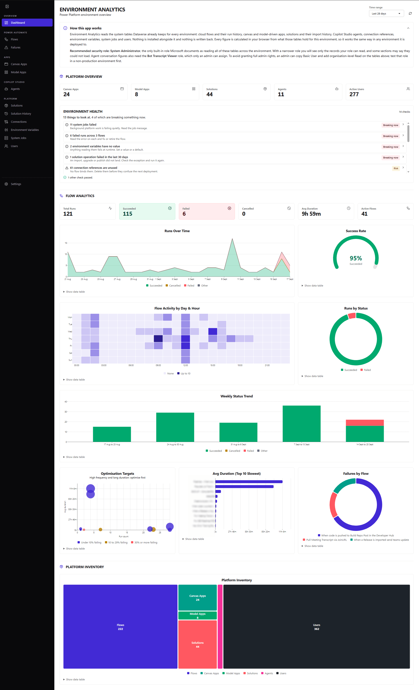

- **How this app works** panel explaining where the data comes from and the security role to use (collapsible, remembers its state)
- Platform tiles: canvas apps, model-driven apps, solutions, agents and active users
- **Environment health**: fourteen checks over the environment, ranked, each with a count, what to do about it and a link to the records behind it. Unresolved environment variables, flows that have never succeeded, failed runs, failed solution operations and failed system jobs come first; then orphaned connection references, references outside a solution, flows binding connectors directly and assets owned by disabled users; then housekeeping such as flows that have not run, stale canvas apps and agents never published
- Flow run tiles: total, succeeded, failed, cancelled, average duration and active flows
- **Runs Over Time** by status, and a **Success Rate** gauge
- **Flow Activity by Day & Hour** heatmap showing when flows run
- **Runs by Status**, **Weekly Status Trend**, **Failures by Flow**
- **Optimisation Targets**: flows plotted by run count against average duration, sized by total time and coloured by failure rate
- **Avg Duration (Top 10 Slowest)** flows
- **Platform Inventory** treemap of flows, apps, solutions, agents and users
- Time range of 7, 14 or 28 days
- If a data source can't load (missing permissions, or no Copilot Studio in the environment), it is named with the reason and a **Try again** button, and its tiles show a dash rather than a misleading zero

### Cloud Flows

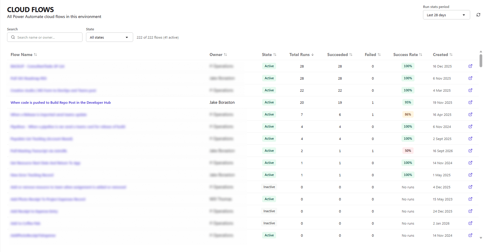

- Every cloud flow with its owner, state, created date and, for the selected period, total, succeeded and failed runs and success rate
- Search by name or owner, filter by state, sort any column
- Open any flow in Power Automate

### Flow detail

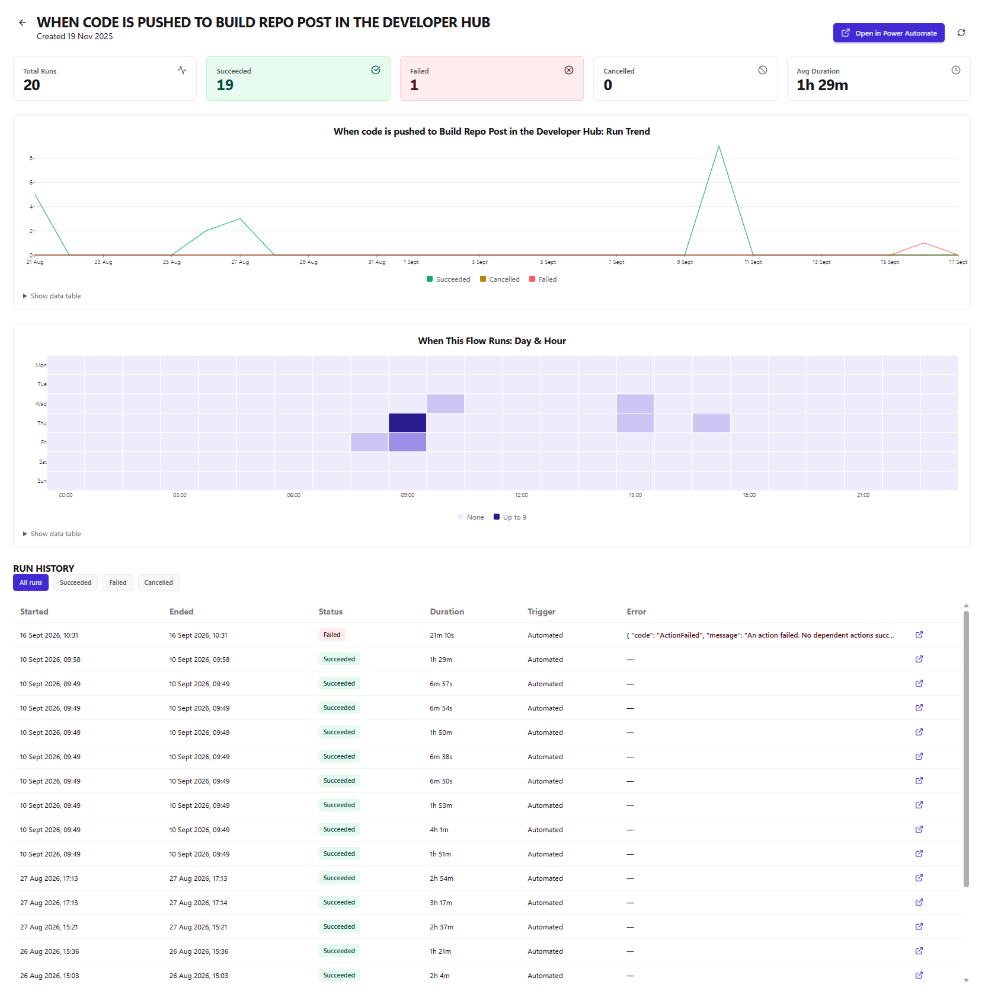

- Run tiles: total, succeeded, failed, cancelled and average duration
- Run trend over the period, and a day-and-hour heatmap for this flow
- Run history filtered by result, with start and end times, duration, trigger and error
- Links to the flow and to each run in Power Automate

### Failures & Cancellations

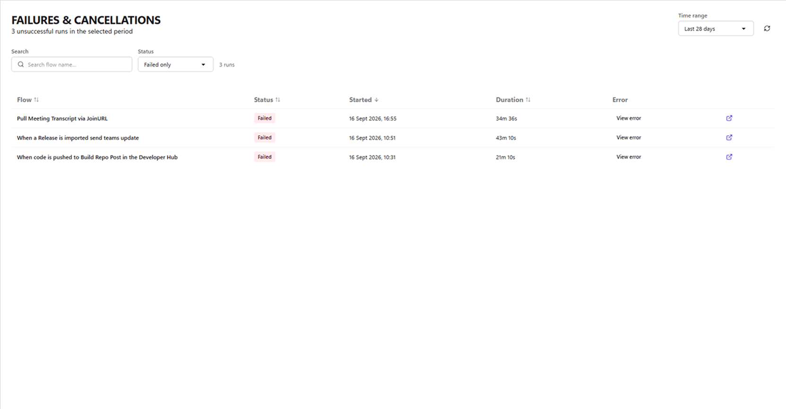

- Every failed or cancelled run in the period, newest first
- Filter by result, search by flow name, sort any column
- Error dialog with a readable summary and the raw error JSON
- One click to the run in Power Automate

### Connections

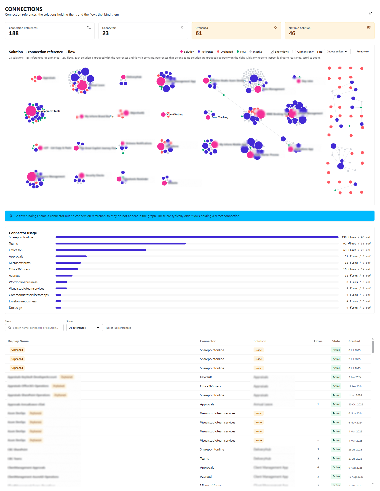

- Tiles for connection references, connectors in use, orphaned references and references outside any solution
- Interactive graph linking solutions, connection references and the flows that use them. Drag, zoom and click to isolate, or use **Find** from the keyboard
- Connector usage by number of flows
- A note on flows that bind a connector directly rather than through a connection reference
- Reference inventory with connector, solution, flow count and state, filterable to orphaned or unsolutioned references

### Canvas Apps

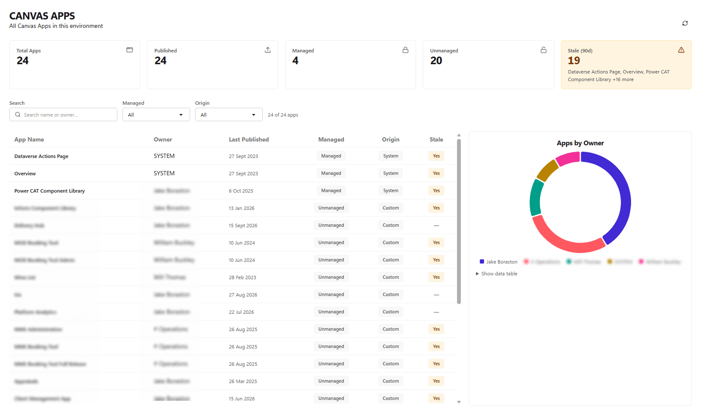

- Tiles for total, published, managed, unmanaged and stale apps (not modified in 90 days), with the stale apps named
- App inventory with owner, last published date, managed state, origin (system or custom) and stale flag
- Search by name or owner; filter by managed state and origin
- **Apps by Owner** chart

### Model-driven Apps

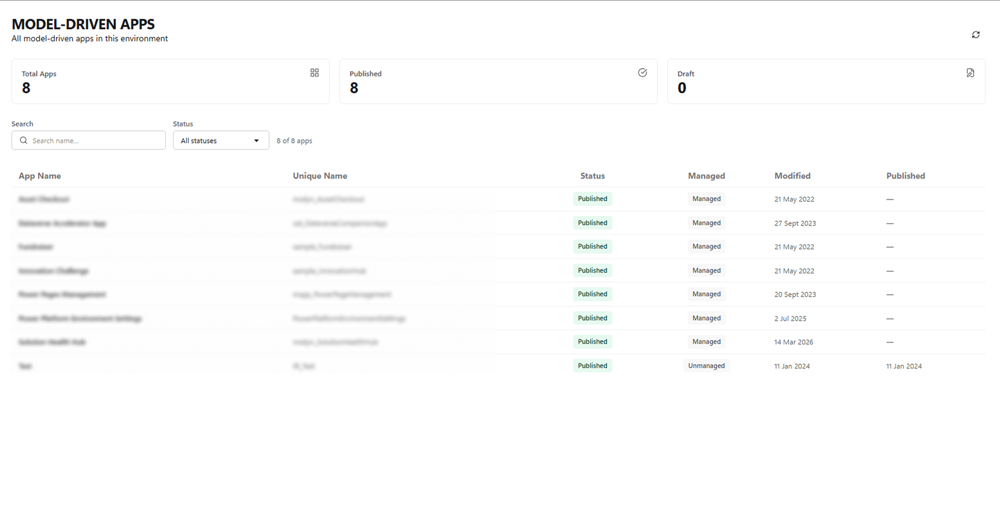

- Tiles for total, published and draft apps
- App inventory with unique name, status, managed state, modified and published dates
- Search by name; filter by status

### Copilot Studio Agents

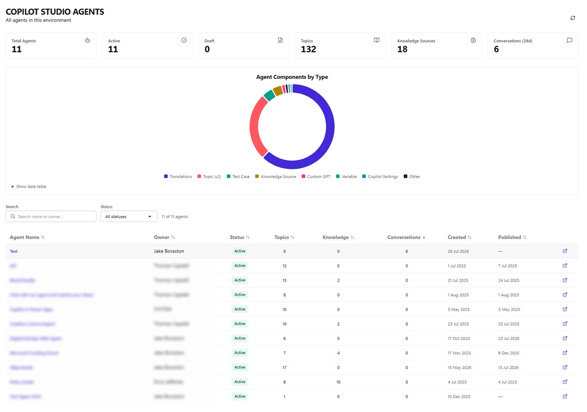

- Tiles for total, active and draft agents, topics, knowledge sources and conversations in the last 28 days
- **Agent Components by Type** chart
- Agent inventory with owner, status, topic, knowledge source and conversation counts, created and published dates; sortable
- Open any agent in Copilot Studio

### Agent detail

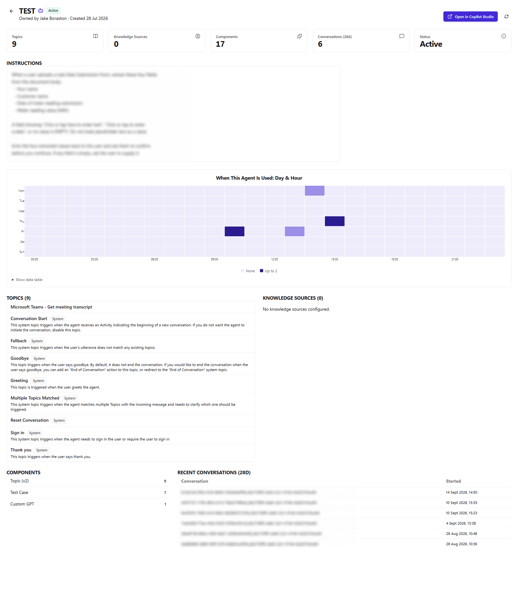

- Tiles for topics, knowledge sources, components, conversations and status
- The agent's instructions and conversation starters
- Day-and-hour heatmap of when the agent is used
- Topics (system topics flagged) and knowledge sources with their type and location
- Component breakdown and recent conversations

### Solutions

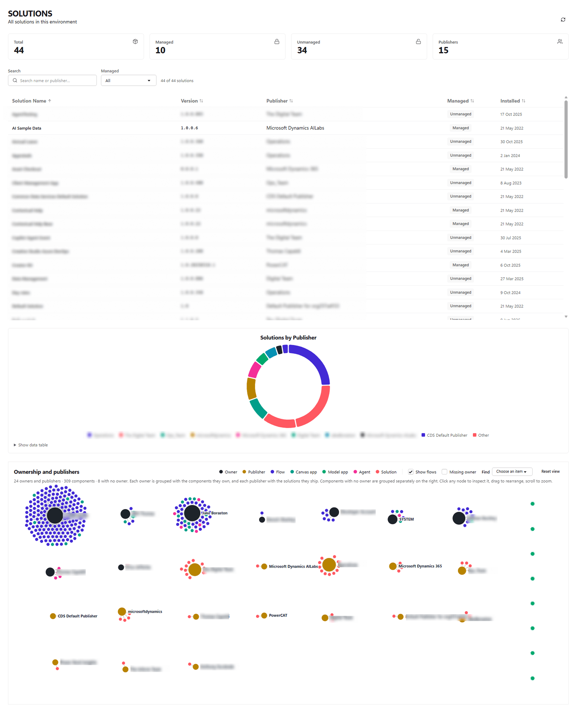

- Tiles for total, managed and unmanaged solutions, and publishers
- Solution inventory with version, publisher, managed state and install date; searchable, filterable and sortable
- **Solutions by Publisher** chart
- Ownership graph linking solutions to the flows, apps and agents they contain

### Solution History

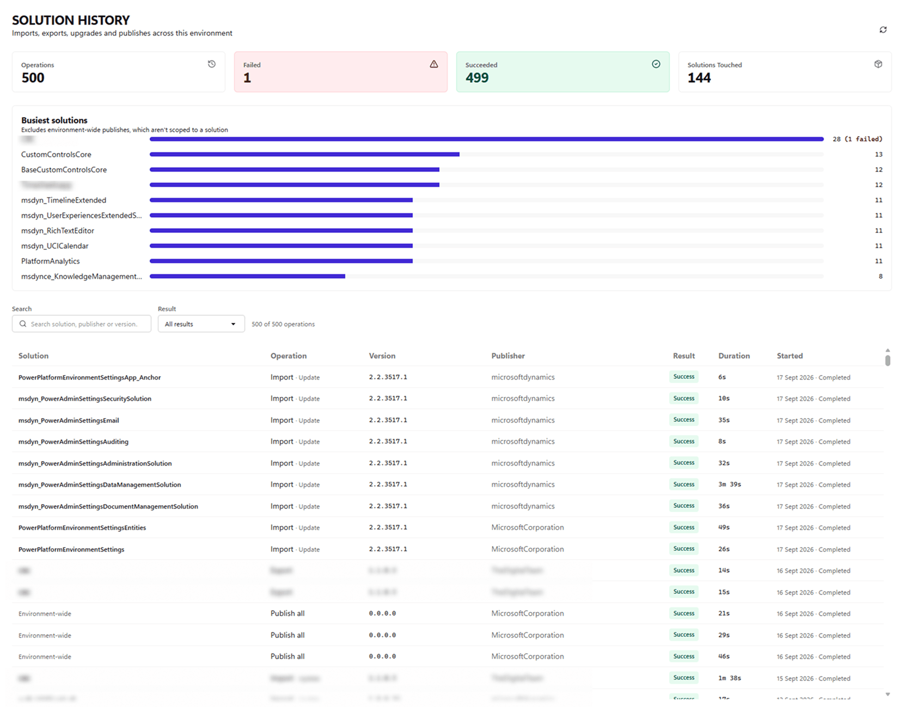

- Tiles for operations, failed, succeeded and solutions touched
- **Busiest solutions**, with failures called out
- Every import, export, upgrade and publish with version, publisher, result, duration and status; the exception message on hover for failures
- Search by solution, publisher or version; filter by result

### Environment Variables

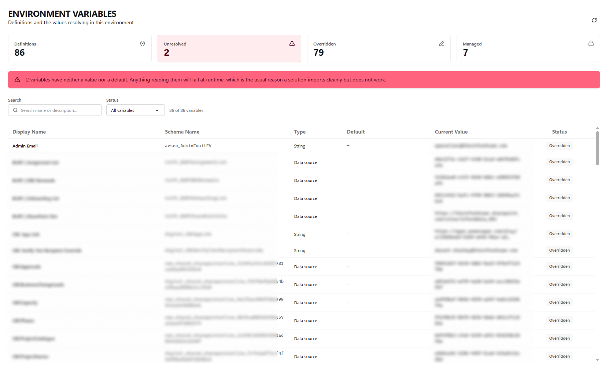

- Tiles for definitions, unresolved, overridden and managed variables
- Warning when a variable has neither a value nor a default, the usual reason a solution imports cleanly but fails at runtime
- Definitions joined to their current values, with type, default and status
- Search by name or description; filter to unresolved, overridden or default

### System Jobs

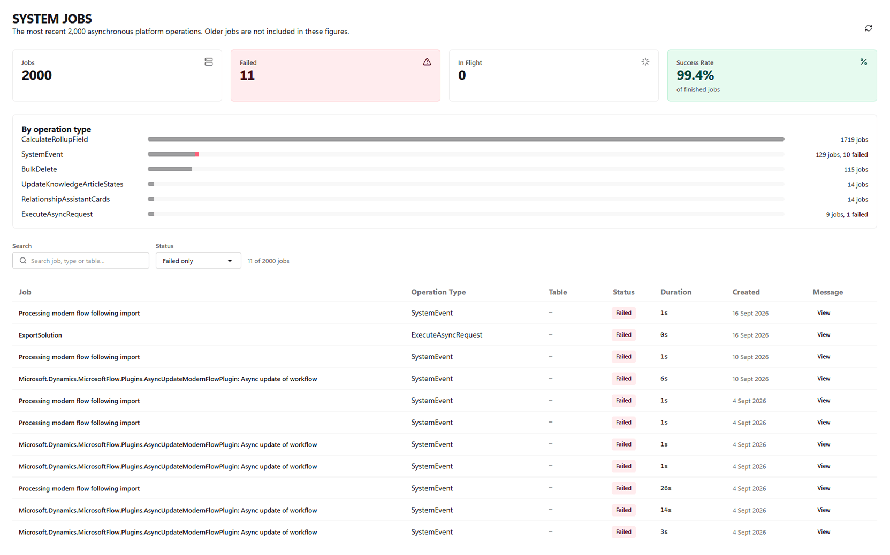

- Tiles for jobs, failed, in flight and success rate of finished jobs
- Jobs by operation type, with the failed share of each shown in red
- Job list (failed only by default) with operation type, table, status, duration and created date
- Full job message in a dialog

### Users

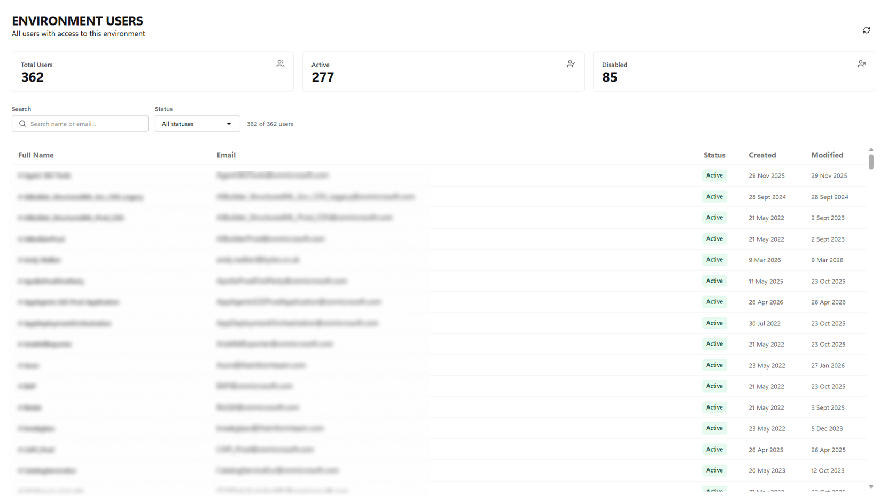

- Tiles for total, active and disabled users
- User list with email, status, created and modified dates
- Search by name or email; filter by status

### Settings

- Theme: match my device, light or dark (remembered in the browser)
- Flow run period used across the dashboard, Flows and Failures
- The environment ID the app is connected to

## Before you deploy

- **Code apps enabled.** In the Power Platform admin center, open the
  environment, then Settings > Product > Features, and turn on
  *Enable code apps*.
- **Licences.** People who open the app need Power Apps Premium.
- **Security role.** System Administrator is the only built-in role Microsoft
  documents as reading all of the tables below across the environment. With a
  narrower role, people see only what their role can read, and the affected
  sections say they could not load. For least privilege, copy Basic User and add
  organisation-level Read on the tables below, then test it in a non-production
  environment. Agent conversation figures also need Bot Transcript Viewer, which
  only an admin can assign.
- **Flow run history.** Runs are only recorded for flows whose owner has Read on
  the Flow Run table, and are kept for 28 days by default.
- **Copilot Studio.** The agent pages need Copilot Studio's tables. Where they
  don't exist, those pages say so and the rest of the app works as normal.

Tables read: `workflow`, `flowrun`, `canvasapp`, `appmodule`, `solution`,
`solutioncomponent`, `msdyn_solutionhistory`, `bot`, `botcomponent`,
`conversationtranscript`, `systemuser`, `connectionreference`,
`environmentvariabledefinition`, `environmentvariablevalue`, `asyncoperation`.

## Build and deploy from source

Requires Node.js 20.19 or later (the minimum for Vite 7).

1. `npm install`
2. `npx power-apps login` and sign in to the target tenant.
3. In `power.config.json`, set `environmentId` to your environment's ID. Leave
   `appId` empty; the first push creates the app and records its ID there. To
   keep configs for several environments, copy it to `power.config.<name>.json`
   (those are gitignored) and swap the one you need into place.
4. `npx power-apps refresh-data-source` to regenerate the table schemas against
   your environment.
5. `npm run build`
6. `npx power-apps push`. Add `--solution-id <guid>` to place the app in a
   specific solution; without it the first push uses the environment's
   preferred solution.

## Local development

```bash
npm install
npm run dev     # prints a Local Play URL that opens the app inside Power Apps
npm run check   # type and accessibility checks
```

Open the **Local Play** URL the dev server prints, not `localhost`. The app
needs the Power Apps host to reach Dataverse.
